# 🚀 Chatrix Hub - Professional Real-Time Chat Application

A beautiful, modern real-time chat application built with the MERN stack and enhanced with **ShadCN UI** components for a truly professional user experience.

## 👥 Team Details

| Role | Name | ID | Email | GitHub | Specialization |
|------|------|-------|-------|--------|----------------|
| **Team Leader** | Nikhil Vaghela | 23DCE124 | 23dce124@charusat.edu.in | [@NikhilVaghela07](https://github.com/NikhilVaghela07) | Frontend |
| Team Member | Femil Ranparia | 23DCE102 | 23dce102@charusat.edu.in | [@FemilRanparia](https://github.com/FemilRanparia) | Frontend |
| Team Member | Hitarth Shukla | 23DCE112 | 23dce112@charusat.edu.in | [@HitarthShukla](https://github.com/HitarthShukla) | Backend |
| Team Member | Kaustav Das | 23DCE020 | 23dce020@charusat.edu.in | [@kaustav1703](https://github.com/kaustav3071) | Backend |

## 📸 Screenshots

### Authentication & Registration Flow
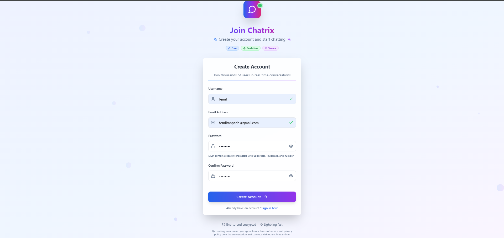
*Modern registration form with professional design*

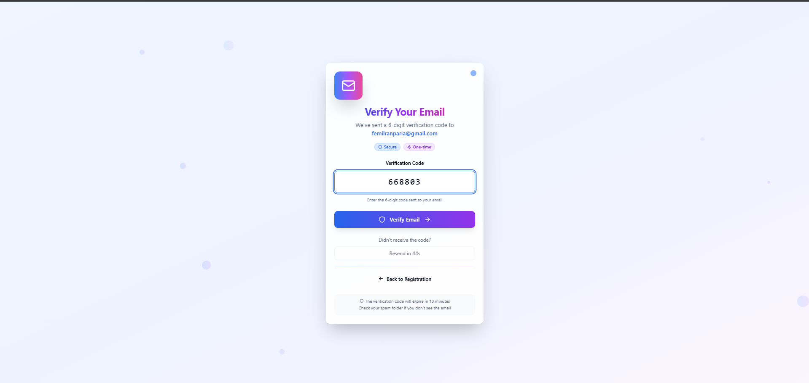
*Email OTP verification for secure authentication*

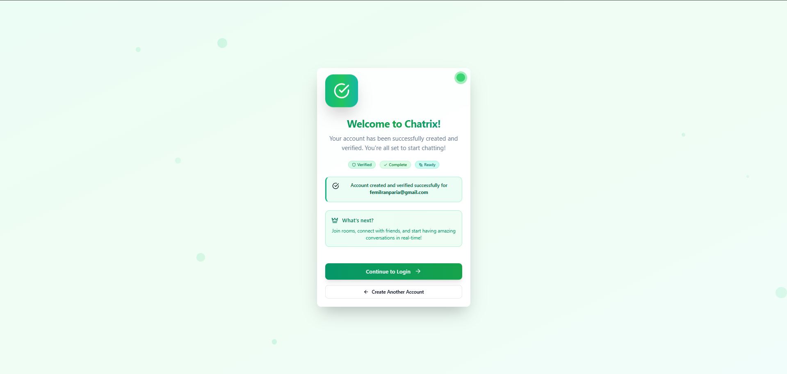
*Registration completion with success feedback*

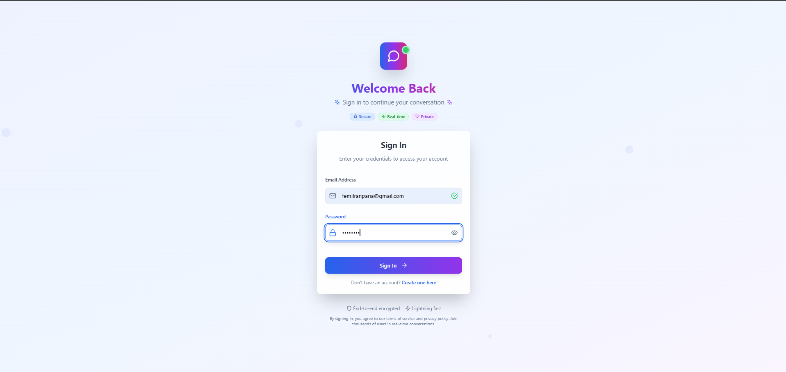
*Clean and professional login interface*

### User Profile Management
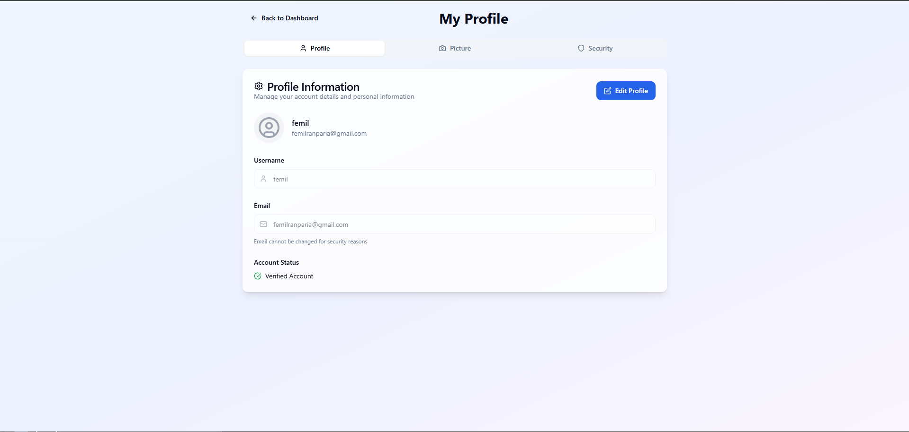
*Comprehensive user profile management*

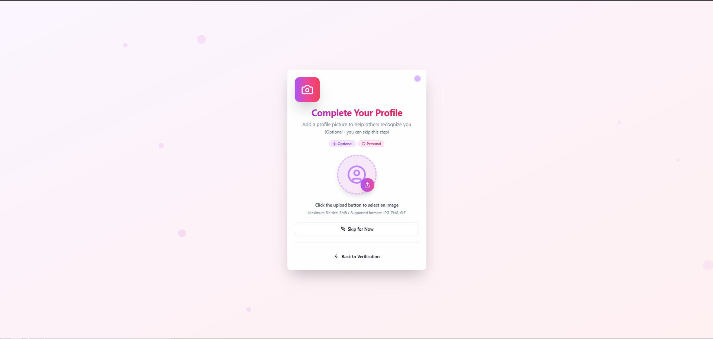
*Profile picture upload during registration*

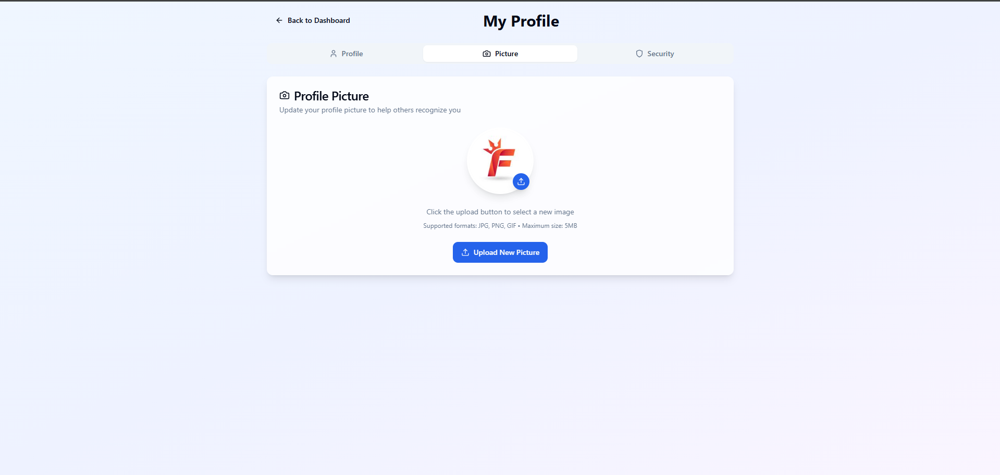
*Profile editing and management interface*

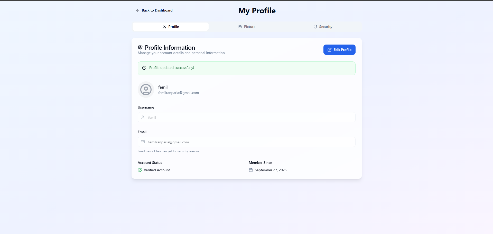
*Updated profile view with all information*

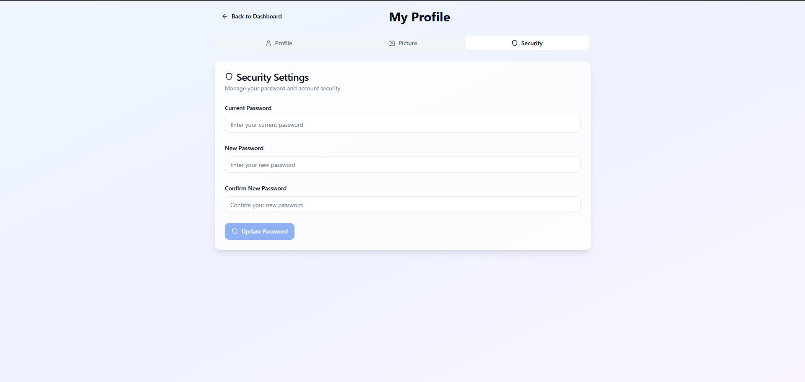
*Profile security and settings management*

### Chat & Room Features
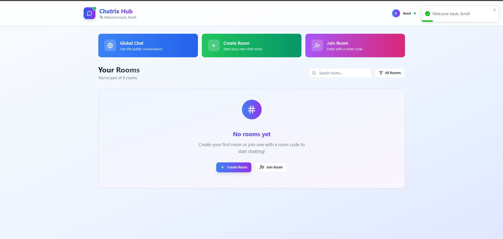
*Main dashboard with navigation options*

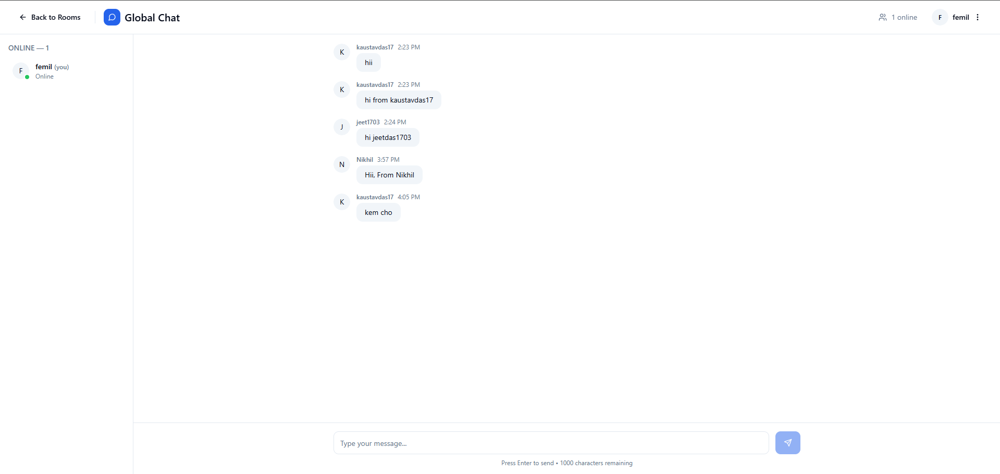
*Real-time global chat interface*

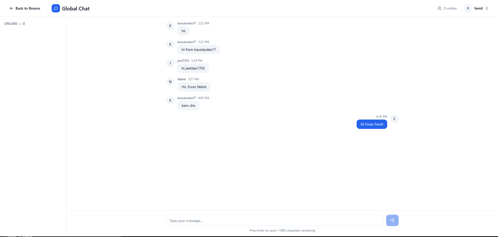
*Extended view of global chat with multiple users*

### Room Management
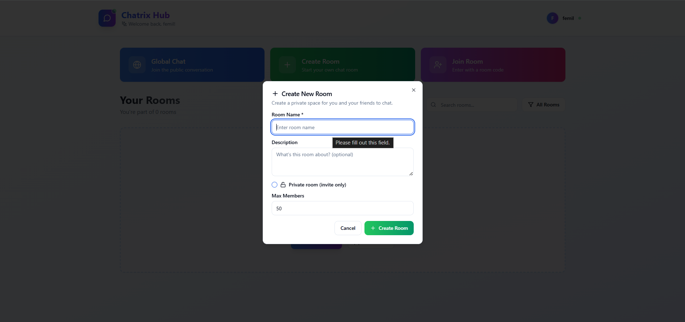
*Room creation interface*

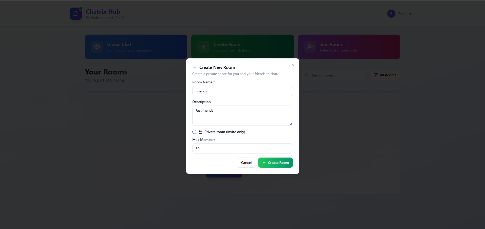
*Room creation form with details*

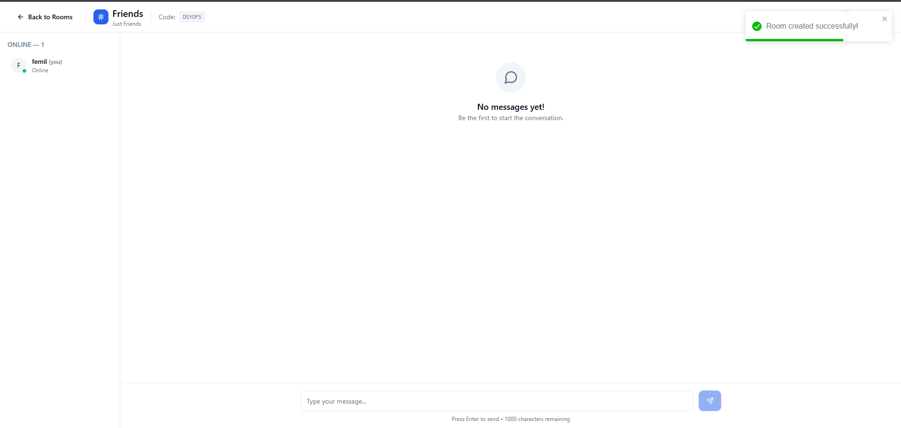
*Success feedback after room creation*

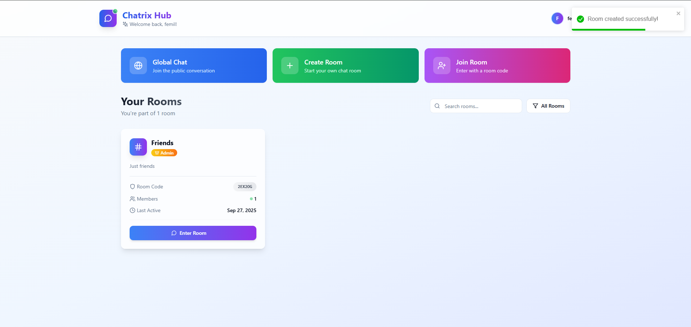
*Dashboard view after creating a room*

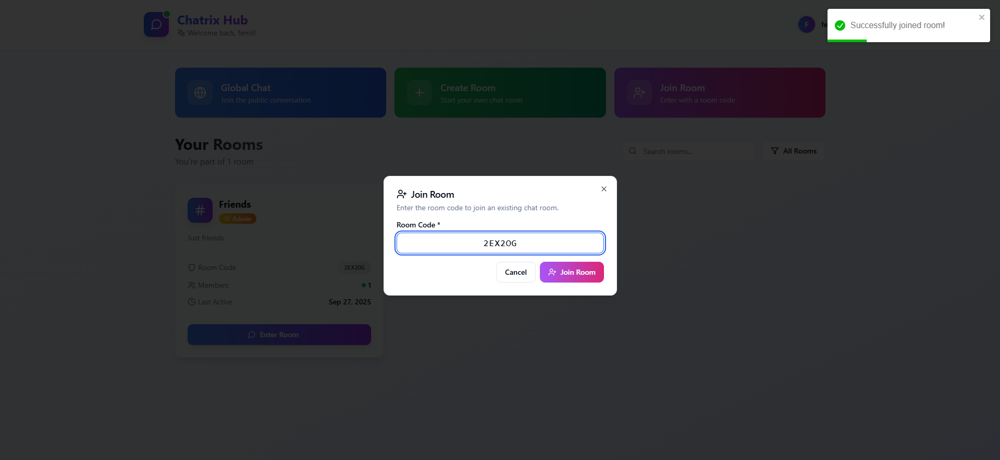
*Join existing room using invitation code*
## ✨ Features

### 🎨 **Professional UI Design**
- **ShadCN UI Components** - Modern, accessible components built on Radix UI
- **Tailwind CSS** - Utility-first CSS framework for responsive design
- **Modern Design System** - Consistent spacing, typography, and colors
- **Dark Mode Ready** - Respects system preferences
- **Smooth Animations** - Professional micro-interactions and transitions

### 🔐 **Authentication & Security**
- JWT-based authentication with secure password hashing (bcryptjs)
- Input validation and sanitization
- Protected routes with automatic token refresh
- Rate limiting and security headers (Helmet)
- CORS configuration for secure cross-origin requests

### 💬 **Real-time Chat Features**
- **Instant Messaging** - Socket.io for real-time communication
- **User Presence** - Live online/offline status indicators
- **Typing Indicators** - See when others are typing
- **Message History** - Persistent chat history with MongoDB
- **Join/Leave Notifications** - Real-time user activity alerts
- **Message Timestamps** - Smart time formatting (relative/absolute)

### 📱 **Modern User Experience**
- **Responsive Design** - Works seamlessly on desktop, tablet, and mobile
- **Professional Avatars** - Auto-generated user avatars with initials
- **Dropdown Menus** - Clean user settings and options
- **Scrollable Message Area** - Smooth auto-scroll to latest messages
- **Character Counter** - Real-time feedback on message length
- **Loading States** - Professional loading indicators throughout

## �🛠️ Tech Stack

### Frontend
- **React.js 18** - Modern React with hooks and context
- **ShadCN UI** - Professional component library
- **Tailwind CSS** - Utility-first CSS framework
- **Radix UI** - Low-level UI primitives
- **Lucide React** - Beautiful icons
- **Socket.io Client** - Real-time communication
- **Axios** - HTTP client with interceptors
- **React Router DOM** - Client-side routing
- **React Toastify** - Toast notifications

### Backend
- **Node.js** - JavaScript runtime
- **Express.js** - Web application framework
- **Socket.io** - Real-time bidirectional communication
- **MongoDB** - NoSQL database
- **Mongoose** - MongoDB object modeling
- **JWT** - JSON Web Tokens for authentication
- **bcryptjs** - Password hashing
- **Helmet** - Security middleware
- **CORS** - Cross-origin resource sharing
- **Rate Limiting** - API protection

## 🚀 Quick Start

### Prerequisites
- Node.js (v16 or higher)
- MongoDB (v4.4 or higher)
- npm or yarn

### Installation

1. **Clone the repository**
```bash
git clone https://github.com/your-username/chatrix.git
cd chatrix
```

2. **Install dependencies**
```bash
# Install backend dependencies
cd backend
npm install

# Install frontend dependencies
cd ../frontend
npm install
```

3. **Environment Setup**

Create `.env` file in the `backend` directory:
```env
MONGODB_URI=mongodb://localhost:27017/chatrix
JWT_SECRET=your_super_secret_jwt_key_change_this_in_production
PORT=5000
NODE_ENV=development
```

4. **Start the application**

**Backend (Terminal 1):**
```bash
cd backend
npm run dev
```

**Frontend (Terminal 2):**
```bash
cd frontend
npm start
```

5. **Open your browser**
Navigate to `http://localhost:3000`

## 🎨 UI Components Showcase

### Login Page
- Modern card-based layout with backdrop blur
- Icon-enhanced input fields
- Professional loading states
- Form validation with error messages
- Responsive design for all screen sizes

### Register Page
- Step-by-step form with real-time validation
- Password strength indicators
- Professional error handling
- Smooth transitions between states

### Chat Interface
- **Header**: Clean navigation with user dropdown menu
- **Sidebar**: Live user list with online status indicators
- **Messages**: Professional message bubbles with timestamps
- **Input**: Modern message composer with character counter
- **Animations**: Smooth message sliding and typing indicators

## 🔧 API Documentation

### Authentication Endpoints
- `POST /api/auth/register` - User registration
- `POST /api/auth/login` - User login
- `POST /api/auth/logout` - User logout
- `GET /api/auth/me` - Get current user
- `GET /api/auth/users` - Get all users

### Message Endpoints
- `GET /api/messages` - Get chat history
- `GET /api/messages/recent` - Get recent messages
- `POST /api/messages` - Send message
- `PUT /api/messages/:id` - Edit message
- `DELETE /api/messages/:id` - Delete message
- `GET /api/messages/search` - Search messages

### Socket Events

**Client → Server:**
- `sendMessage` - Send new message
- `typing` - Send typing indicator

**Server → Client:**
- `newMessage` - Receive new message
- `userJoined` - User joined notification
- `userLeft` - User left notification
- `activeUsers` - Active users list update
- `userTyping` - Typing indicator from other users

## 📱 Responsive Design

The application is fully responsive and works beautifully on:
- **Desktop** (1024px+) - Full sidebar and chat interface
- **Tablet** (768px - 1023px) - Collapsible sidebar
- **Mobile** (< 768px) - Mobile-optimized layout with drawer navigation

## 🎯 Professional Features

### Design System
- Consistent color palette with CSS custom properties
- Typography scale using Inter font family
- Spacing system based on Tailwind's design tokens
- Component variants for different states and sizes

### Accessibility
- ARIA labels and roles for screen readers
- Keyboard navigation support
- Focus management for better UX
- High contrast colors for readability

### Performance
- Code splitting with React Router
- Optimized bundle size with tree shaking
- Efficient re-renders with React hooks
- Socket.io connection management

## 🚀 Deployment

### Frontend (Vercel/Netlify)
```bash
cd frontend
npm run build
# Deploy build folder to your hosting platform
```

### Backend (Heroku/Railway/DigitalOcean)
```bash
cd backend
# Set environment variables in your hosting platform
# Deploy backend folder
```

### Database (MongoDB Atlas)
Set up a MongoDB Atlas cluster and update the connection string.

## 🤝 Contributing

1. Fork the repository
2. Create your feature branch (`git checkout -b feature/amazing-feature`)
3. Commit your changes (`git commit -m 'Add some amazing feature'`)
4. Push to the branch (`git push origin feature/amazing-feature`)
5. Open a Pull Request

## 📄 License

This project is licensed under the MIT License - see the [LICENSE](LICENSE) file for details.

## 🙏 Acknowledgments

- [ShadCN UI](https://ui.shadcn.com/) for the beautiful component library
- [Radix UI](https://www.radix-ui.com/) for accessible primitives
- [Tailwind CSS](https://tailwindcss.com/) for the utility-first approach
- [Lucide](https://lucide.dev/) for the icon library
- [Socket.io](https://socket.io/) for real-time communication

---

Built with ❤️ using modern web technologies
